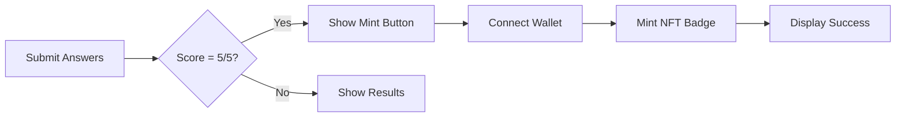

<div align="center">

# 🧠 Base Genius

### Weekly Quiz Mini-App for Base & Farcaster

**Test your knowledge. Mint your achievement. Engage with the community.**

[](https://base-genius.vercel.app/)
[](https://nextjs.org/)
[](https://www.typescriptlang.org/)
[](https://base.org/)

</div>

---

## 📖 Introduction

**Base Genius** is a lightweight, mobile-first mini-app designed for the **Base blockchain** and **Farcaster ecosystem**. 

🎯 **What it does:**
- Runs a **weekly 5-question quiz** testing users on recent Base/Farcaster news and community events
- Optimized for mini-app frames and social wallet flows
- Perfect scorers can **mint a collectible on-chain badge NFT** as proof of knowledge and engagement

💡 **Perfect for:**
- Community growth and engagement
- Low-friction educational experiences  
- Weekly content updates with minimal overhead

---

## ✨ Features

| Feature | Description |
|---------|-------------|
| 🎲 **Randomized Questions** | 5 questions randomly selected from a pool of 50+ |
| 🔒 **Anti-Cheat** | Server-side validation, answers never sent to client |
| 🏆 **NFT Rewards** | Mint on-chain badges for perfect scores |
| 📱 **Mobile-First** | Optimized for Farcaster frames and social wallets |
| 🤖 **AI-Assisted** | Weekly question generation using Gemini AI |
| ⚡ **Fast & Light** | Next.js 16 with TypeScript and Tailwind CSS |

---

## 🏗️ Tech Stack

```
Framework    → Next.js 16 (App Router)
Language     → TypeScript
Styling      → Tailwind CSS
Blockchain   → Base (Ethereum L2)
Web3 Tools   → OnchainKit (wallet & minting)
Data Layer   → JSON-based API routes
```

> [!NOTE]
> All question validation happens **server-side** to prevent cheating. Correct answers are never sent to the client.

---

## 📁 Repository Structure

<details open>
<summary><b>📂 app/</b> — Next.js App Router</summary>

```
app/
├── 📄 page.tsx                      # Main game UI & state machine
├── 📄 layout.tsx                    # Root layout
├── 📄 globals.css                   # Global styles
│
├── 📂 api/                          # Server-side API routes
│   ├── questions/route.ts           # GET: 5 randomized questions
│   ├── submit-answers/route.ts      # POST: Validate answers
│   └── auth/route.ts                # Auth helper
│
├── 📂 components/                   # React components
│   ├── QuizCard.tsx
│   ├── ResultsCard.tsx
│   ├── MintBadgeButton.tsx
│   └── ConnectWallet.tsx
│
├── 📂 data/
│   └── quiz-questions.json          # 50+ questions with metadata
│
└── 📂 types/
    └── quiz.ts                      # TypeScript type definitions
```

</details>

<details>
<summary><b>⚙️ contracts/</b> — Smart Contracts</summary>

```
contracts/
├── BaseGeniusBadge.sol              # Solidity NFT contract
└── BaseGeniusBadgeABI.ts            # ABI for app integration
```

</details>

<details>
<summary><b>🔧 scripts/</b> — Helper Scripts</summary>

```
scripts/
├── generate_weekly_questions.py     # 🤖 AI question generator
├── generate-signer-wallet.ts
└── check-contract-signer.ts
```

</details>

<details>
<summary><b>🖼️ public/metadata/</b> — NFT Metadata</summary>

```
public/metadata/
├── week-50.json
├── week-51.json
└── ...
```

</details>

---

## 🔄 Data Flow & API Contract

### **GET** `/api/questions`

**Purpose:** Fetch 5 randomized quiz questions

```typescript
// Response
{
  questions: Array<{
    id: string;
    question: string;
    options: string[];
    // ⚠️ correctAnswer NOT included (anti-cheat)
  }>
}
```

> [!IMPORTANT]
> Query params support excluding recently served question IDs to prevent repetition.

### **POST** `/api/submit-answers`

**Purpose:** Validate user answers and return detailed results

```typescript
// Request Body
{
  answers: Array<{
    questionId: string;
    selectedIndex: number;
  }>
}

// Response
{
  score: number;
  results: Array<{
    questionId: string;
    correct: boolean;
    explanation: string;
  }>
}
```

### 🏆 Minting Flow



---

## 🚀 Getting Started

### Prerequisites

| Tool | Version | Required |
|------|---------|----------|
| Node.js | v18+ | ✅ Yes |
| npm/pnpm | Latest | ✅ Yes |
| Ethereum Wallet | - | 🔧 Optional (for testing mints) |

### Installation

```bash
# 1️⃣ Clone the repository
git clone https://github.com/yourusername/base-genius.git
cd base-genius

# 2️⃣ Install dependencies
npm install

# 3️⃣ Set up environment variables
cp .env.example .env
# Edit .env with your API keys

# 4️⃣ Run development server
npm run dev
```

🌐 **Open** [http://localhost:3000](http://localhost:3000) in your browser

### Production Build

```bash
npm run build
npm start
```

> [!TIP]
> For Farcaster mini-app frame compatibility, the app uses `useMiniKit()` and `setFrameReady()` hooks.

---

## 🔐 Environment & Secrets

Create a `.env` file from the example template:

```bash
cp .env.example .env
```

**Required API Keys:**

| Variable | Purpose | Where to Get |
|----------|---------|--------------|
| `GEMINI_API_KEY` | AI question generation | [Google AI Studio](https://aistudio.google.com/) |
| `NEYNAR_API_KEY` | Farcaster data fetching | [Neynar Dashboard](https://neynar.com/) |

> [!WARNING]
> Never commit `.env` files to version control. These keys should remain secret.

📚 **More details:** See [`docs/ai-setup-guide.md`](docs/ai-setup-guide.md) for complete setup instructions.

---

## 🤖 Weekly Question Generation

The app includes an **AI-powered script** to generate fresh quiz questions weekly.

### Setup Python Environment

```bash
# Create virtual environment
python3 -m venv .venv

# Activate (Linux/Mac)
source .venv/bin/activate

# Activate (Windows)
.venv\Scripts\activate

# Install dependencies
pip install -r scripts/requirements.txt
```

### Generate Questions

```bash
python3 scripts/generate_weekly_questions.py
```

**What it does:**
- ✍️ Generates new questions using Gemini AI
- 📝 Updates `data/quiz-questions.json`
- 🖼️ Creates metadata files in `public/metadata/`
- 🔍 Validates question format and structure

> [!TIP]
> Set up a GitHub Action to run this weekly for automated content updates!

---

## 🎨 NFT Minting System

### Requirements for Minting

| Requirement | Description |
|-------------|-------------|
| 🎯 **Perfect Score** | User must answer all 5 questions correctly |
| 👛 **Connected Wallet** | Must connect wallet via OnchainKit |
| ⛓️ **Base Network** | NFT mints on Base blockchain |

### Minting Components

```
lib/nftService.ts          → Core minting logic
components/MintBadgeButton.tsx  → UI component
contracts/BaseGeniusBadge.sol   → Smart contract
public/metadata/week-*.json     → NFT metadata
```

### Setup Instructions

📖 **Complete guide:** [`NFT_SETUP_INSTRUCTIONS.md`](NFT_SETUP_INSTRUCTIONS.md)

Covers:
- Contract deployment
- Configuration
- Metadata setup
- Testing

---

## ✅ Testing & Quality

### Type Checking

```bash
npm run build  # Catches TypeScript errors
```

### Recommended Tests

| Area | Test Type | Priority |
|------|-----------|----------|
| 📝 Question validation | Unit tests | High |
| 🔀 Shuffling logic | Unit tests | High |
| 🔌 API routes | Integration | Medium |
| 🎨 UI components | Component tests | Low |

> [!NOTE]
> Test suites not included by default. Add your preferred testing framework (Jest, Vitest, etc.).

---

## 💡 Developer Tips & Conventions

### State Management
- 🎮 **Game State:** Uses `useState` for simple state machine (`welcome` → `loading` → `quiz` → `results`)
- 🚫 **No Redux/Zustand:** Keep it lightweight for mini-app performance

### Styling Guidelines
- 🎨 **Tailwind CSS:** Utility-first approach
- 📱 **Mobile-First:** Designed for Farcaster frames
- ✨ **Consistency:** Use design tokens for colors and spacing

### Security Best Practices
- 🔒 **Server-Side Validation:** All answer checking happens on the server
- 🎲 **Fisher-Yates Shuffle:** Random question selection
- 🚫 **No Client-Side Answers:** Correct answers never sent to client

### API Conventions
> [!IMPORTANT]
> When changing API routes, always update `types/quiz.ts` to maintain type safety.

---

## 📚 Key Files Reference

Quick reference to the most important files in the codebase:

| File | Purpose | Priority |
|------|---------|----------|
| `app/page.tsx` | Main game UI & state transitions | 🔴 Critical |
| `app/api/questions/route.ts` | Question randomization & serving | 🔴 Critical |
| `app/api/submit-answers/route.ts` | Server-side answer validation | 🔴 Critical |
| `data/quiz-questions.json` | Question pool (50+ questions) | 🔴 Critical |
| `lib/nftService.ts` | Minting & Web3 integration | 🟡 Important |
| `contracts/BaseGeniusBadge.sol` | NFT smart contract | 🟡 Important |
| `components/QuizCard.tsx` | Quiz UI component | 🟢 Reference |
| `components/MintBadgeButton.tsx` | Minting UI component | 🟢 Reference |

---

## 🔧 Troubleshooting

<details>
<summary><b>❌ Questions not showing</b></summary>

**Check:**
1. ✅ Verify `data/quiz-questions.json` is valid JSON
2. ✅ Confirm API route is accessible at `/api/questions`
3. ✅ Check browser console for network errors
4. ✅ Ensure at least 5 questions exist in the pool

**Quick test:**
```bash
curl http://localhost:3000/api/questions
```

</details>

<details>
<summary><b>❌ Minting fails</b></summary>

**Check:**
1. ✅ Contract address configured in `minikit.config.ts`
2. ✅ Signer wallet properly configured
3. ✅ User connected to Base network
4. ✅ User has sufficient ETH for gas fees

**Debug command:**
```bash
npx ts-node scripts/check-contract-signer.ts
```

</details>

<details>
<summary><b>❌ TypeScript errors</b></summary>

**Solutions:**
```bash
# Clear cache and reinstall
rm -rf .next node_modules
npm install

# Run type check
npm run build
```

</details>

---

## 🚀 Next Steps & Roadmap

### Recommended Improvements

- [ ] **Testing Suite**
  - Add Jest/Vitest for unit tests
  - Test API validation flow
  - Test question shuffling logic

- [ ] **CI/CD Pipeline**
  - GitHub Actions for `npm run build`
  - ESLint and TypeScript checks on PRs
  - Automated deployment previews

- [ ] **Automated Content**
  - Weekly cron job for question generation
  - Auto-commit generated questions
  - Scheduled metadata updates

- [ ] **Analytics**
  - Track quiz completion rates
  - Monitor minting success rates
  - User engagement metrics

---

<div align="center">

## 🤝 Contributing

Contributions are welcome! Please feel free to submit a Pull Request.

### License

This project is open source and available under the MIT License.

---

**Built with ❤️ for the Base & Farcaster community**

[🌐 Live Demo](https://base-genius.vercel.app/) • [📖 Docs](docs/)

</div>
