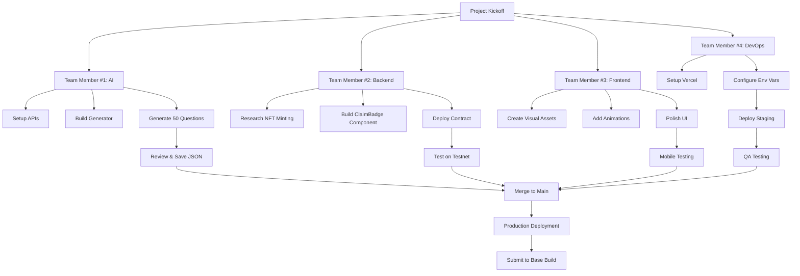

# Development Flow & Workflow

## Overall Architecture

```
┌─────────────────────────────────────────────────────────────┐
│                        BASEGENIUS                            │
│                                                              │
│  User Flow: Welcome → Quiz (5 random Qs) → Results → NFT    │
└─────────────────────────────────────────────────────────────┘
                              ▲
                              │
        ┌────────────────────────────────────┐
        │  4 TEAM MEMBERS WORKING IN PARALLEL │
        └────────────────────────────────────┘
```

---

## Team Workflow (Parallel Development)



---

## Day-by-Day Timeline (7 Days)

### **Day 1: Setup & Foundation**

**Team Member #1 (AI):**
```
Morning:
  ✓ Get Gemini API key
  ✓ Get Neynar API key
  ✓ Add to .env file
  
Afternoon:
  ✓ Install dependencies
  ✓ Create news-fetcher.ts
  ✓ Test fetching Base news
  
Evening:
  ✓ Start building generate-questions.ts
  ✓ Test with 5 sample questions
```

**Team Member #2 (Backend):**
```
Morning:
  ✓ Read OnchainKit NFT docs
  ✓ Decide: existing contract vs custom
  ✓ Research Base testnet setup
  
Afternoon:
  ✓ Create ClaimBadge.tsx skeleton
  ✓ Add wallet connection UI
  
Evening:
  ✓ Test wallet connection locally
```

**Team Member #3 (Frontend):**
```
Morning:
  ✓ Design quiz logo concept
  ✓ Research confetti libraries
  
Afternoon:
  ✓ Generate icon.png (512x512)
  ✓ Generate hero.png (1200x630)
  
Evening:
  ✓ Add confetti to ResultsCard
  ✓ Test locally
```

**Team Member #4 (DevOps):**
```
Morning:
  ✓ Create Vercel project
  ✓ Link to GitHub repo
  
Afternoon:
  ✓ Configure environment variables
  ✓ Test build locally
  
Evening:
  ✓ Deploy staging environment
  ✓ Share URL with team
```

---

### **Days 2-3: Core Development**

**AI Person:**
- Generate first 25 questions
- Review and refine
- Generate final 25 questions
- Manual quality check
- **Output:** `quiz-questions.json` with 50 questions ✅

**Backend Person:**
- Deploy NFT contract to Base testnet
- Implement minting logic
- Test transactions
- **Output:** Working NFT minting ✅

**Frontend Person:**
- Add animations
- Polish UI transitions
- Mobile responsive testing
- **Output:** Beautiful UI ✅

**DevOps Person:**
- Set up CI/CD pipeline
- Test staging deployment
- Document deployment process
- **Output:** Automated deployments ✅

---

### **Days 4-5: Integration**

```
┌──────────────┐
│ Git Workflow │
└──────────────┘

AI Person:                    Backend Person:
  Push quiz-questions.json ─────┐
                                ├──→ Main Branch
Backend Person:               │
  Push ClaimBadge.tsx ─────────┘

Frontend Person:              DevOps Person:
  Push animations ─────────┐
                           ├──→ Main Branch
DevOps Person:             │
  Merge & deploy ──────────┘
```

**Everyone:**
- Merge branches to `main`
- Test integrated app on staging
- Fix any conflicts or bugs
- Cross-test each other's features

---

### **Days 6-7: Testing & Launch**

**Full Team QA:**
```
Day 6 Morning:
  □ Test complete quiz flow
  □ Test NFT minting on testnet
  □ Test with 10+ question combinations
  □ Mobile testing on real devices
  □ Farcaster frame testing

Day 6 Afternoon:
  □ Fix any bugs found
  □ Performance testing
  □ Security review
  □ Final UI polish

Day 7:
  □ Deploy to production
  □ Switch to mainnet contract
  □ Submit to Base Build
  □ Test in Warpcast app
  □ 🚀 LAUNCH!
```

---

## Component Dependencies

### What Each Person Needs from Others:

**AI Person needs:**
- ✅ Nothing! (Works independently)
- Outputs: `quiz-questions.json`

**Backend Person needs:**
- ✅ `quiz-questions.json` from AI person
- Uses it to know what questions exist

**Frontend Person needs:**
- ✅ `ClaimBadge.tsx` interface from Backend
- Integrates into ResultsCard

**DevOps Person needs:**
- ✅ All code merged to main
- ✅ All environment variables documented

### Critical Path:
```
AI generates questions → Backend tests with real questions
                      ↓
Frontend adds ClaimBadge → DevOps deploys everything
```

**Key insight:** AI and Backend can work 100% in parallel! No blocking.

---

## File Ownership

### AI Person Owns:
- `app/lib/news-fetcher.ts`
- `app/lib/generate-questions.ts`
- `app/api/generate-questions/route.ts`
- `app/data/quiz-questions.json`

### Backend Person Owns:
- `app/components/ClaimBadge.tsx`
- `app/lib/nft-config.ts`
- `contracts/` (if custom)

### Frontend Person Owns:
- `app/globals.css`
- `public/icon.png`, `public/hero.png`
- UI polish in existing components

### DevOps Person Owns:
- `README.md`
- `.env.example`
- `docs/deployment.md`
- Vercel configuration

---

## Communication Checkpoints

**Daily Standup (15 min):**
```
Each person answers:
1. What did I complete yesterday?
2. What am I working on today?
3. Am I blocked on anything?
```

**Integration Points:**
```
Day 3: AI shares quiz-questions.json in Slack
       → Backend tests NFT with real questions

Day 5: Backend shares ClaimBadge PR
       → Frontend integrates in ResultsCard

Day 6: Everyone tests on staging
       → DevOps coordinates production deployment
```

---

## Success Metrics

**Ready to Deploy Checklist:**

AI Work:
- [ ] 50 questions generated and reviewed
- [ ] All questions have 4 options + explanations
- [ ] Mix of easy/medium/hard difficulty
- [ ] JSON file committed to repo

Backend Work:
- [ ] NFT minting works on testnet
- [ ] Wallet connection functional
- [ ] Error handling in place
- [ ] Contract deployed and verified

Frontend Work:
- [ ] All visual assets created
- [ ] Animations working smoothly
- [ ] Mobile responsive (tested on phone)
- [ ] Confetti effect for perfect scores

DevOps Work:
- [ ] Staging environment working
- [ ] All env vars documented
- [ ] Build passes without errors
- [ ] Base Build submission ready

---

## Launch Day Workflow

```
Hour 1: Final Testing
  - Each person tests their own work
  - Cross-test as a team

Hour 2: Production Deploy
  - DevOps deploys to prod
  - Team monitors for errors

Hour 3: Base Build Submission
  - DevOps submits app
  - Test in Warpcast

Hour 4: Celebrate! 🎉
  - Share on Farcaster
  - Monitor for user feedback
```

---

## Post-Launch

**Weekly Maintenance (AI Person):**
```
Every Monday:
1. Run question generator
2. Review new questions (30 min)
3. Deploy new questions
```

**As Needed (Backend):**
- Monitor NFT minting
- Update contract if needed

**Ongoing (Frontend):**
- UI improvements based on feedback

**Ongoing (DevOps):**
- Monitor performance
- Handle any production issues

---

## Questions?

**"What if AI person is done early?"**
→ Help with manual question review or testing

**"What if Backend person is blocked?"**
→ Can help DevOps with deployment or testing

**"What if we need to reprioritize?"**
→ Daily standup is where we decide together

**"How do we avoid merge conflicts?"**
→ Different files = no conflicts! This is why we split roles this way.

---

## TL;DR - The Flow

1. **Week 1:** Everyone sets up their piece in parallel
2. **Day 3-4:** Start integrating (AI shares questions, Backend shares NFT)
3. **Day 5-6:** Full integration testing
4. **Day 7:** Deploy and launch! 🚀

**The beauty of this structure:** Nobody blocks anyone else. You can all work at the same time!
